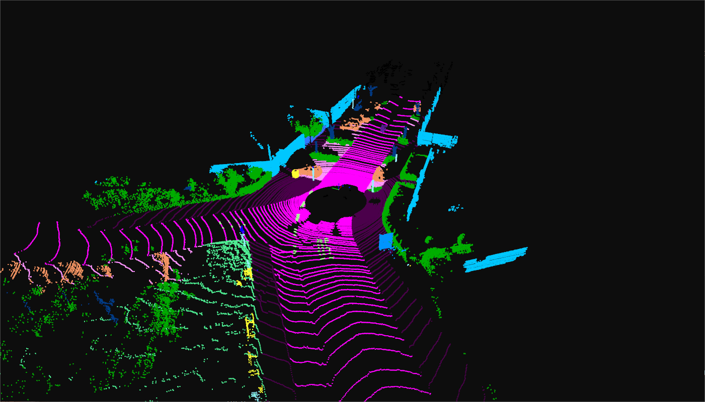

# SemanticKITTI-visualizer
SemanticKITTI-visualizer visualized SemanticKITTI dataset via open3d python 

## How to config the project?
First of all you need to change the path to your SemanticKITTI dataset in src/config/visualizer.yaml, in which you can also modify the GUI position and point size of pcd. We provide an example in src/example and its path in visualizer.yaml.

Up to now visualizer can **only** be used  in SemanticKITTI dataset, each scan and label are stored in binary format of original KITTI Odometry benchmark (xxxxxx.bin) and SemanticKITTI benchmark (xxxxxx.label) respectively. 
SemanticKITTI dataset and the format can be downloaded in [SemanticKITTI](http://www.semantic-kitti.org/index.html)

## How to change initialized viewpoint?
In open3d GUI you can press 'H' to get help about control operation. Press Ctrl+C to copy current viewpoint states into clipboard and Ctrl+V to paste viewpoint to src/config/viewpoint.json to modify initialized viewpoint status.

## How to get next scan or back in open3d GUI?
- Press 'N' to get next scan.
- Press 'B' to get last scan. 

